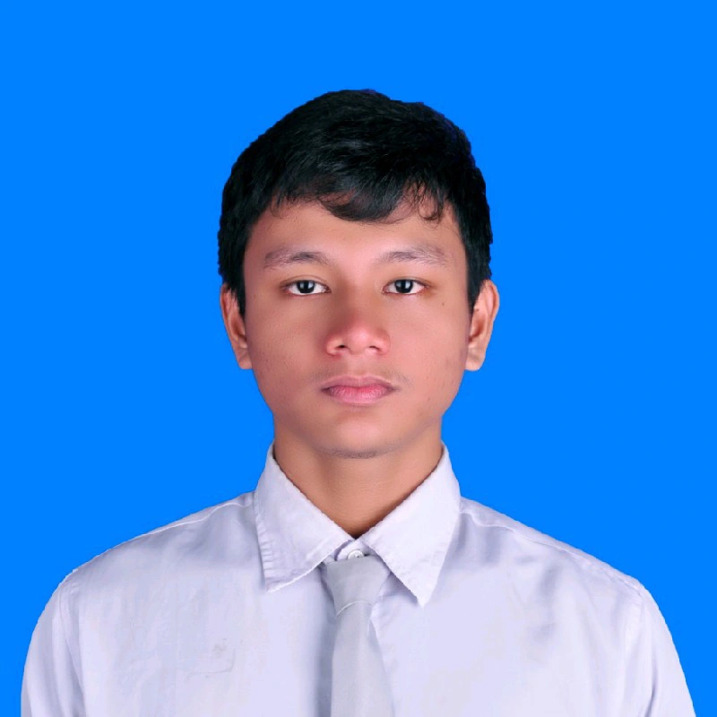
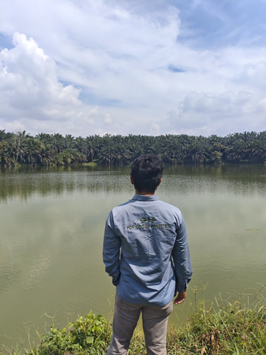

---
hide:
  - toc
  - navigation
---
<!--
CHECKLIST FOR THIS PAGE:
- [ ] Replace [YOUR NAME] with your full name (3 places)
- [ ] Replace [YOUR JOB TITLE] with your current or target role
- [ ] Replace [YOUR TAGLINE] with a short phrase describing your focus
- [ ] Rewrite the About Me paragraph with your own words
- [ ] Replace assets/images/profile.png with your actual photo (keep the filename or update it below)
- [ ] Replace assets/images/about.png with your own image (a field photo, map, or workspace shot)
- [ ] Edit the skill cards to match your actual skills (add, remove, or rename cards as needed)
- [ ] Update GitHub and LinkedIn links in the Connect section
- [ ] Add your CV PDF to docs/assets/ and update the filename in the Download CV button
-->

  
  <h1>Reihan Apriandi</h1>
  
<strong>Forestry & Spatial Data Science</strong>

  
<em>Turning field data into spatial insights | GIS | Remote Sensing</em>

---

## About Me

I am a final-year Forestry undergraduate at Universitas Riau with field and professional
experience in above-ground biomass surveys, land cover analysis, and carbon project.
I apply GIS, remote sensing, and Python-based analytics to problems in sustainable forest
management, land use mapping, and climate-related research — using tools such as QGIS,
Google Earth Engine, and RStudio. I am currently seeking entry-level opportunities in GIS analysis,remote sensing, or environmental data roles.

  

---

[View My Projects :material-arrow-right:](projects/index.md){ .md-button .md-button--primary }
[Download CV :material-download:](assets/reihan-CV.pdf){ .md-button }

---

## Skills

-   :material-layers:{ .lg .middle } **GIS & Remote Sensing**

    ---

    - QGIS, ArcGIS Pro, Google Earth Engine
    - GDAL / OGR, GRASS GIS,GeoDa
    - Multispectral and SAR image analysis
    - Cloud Native Geospatial

-   :material-code-braces:{ .lg .middle } **Programming**

    ---

    - Python — GeoPandas, NumPy, Pandas, Matplotlib
    - R — sf, terra, ggplot2
    - JavaScript
    - SQL, PostgreSQL + PostGIS

-   :material-star-four-points:{ .lg .middle } **Machine Learning & GeoAI**

    ---

    - Supervised classification — Random Forest, XGBoost
    - Deep learning for image segmentation — U-Net, SAM
    - scikit-learn, PyTorch, TensorFlow
    - Object detection in satellite imagery

-   :material-earth:{ .lg .middle } **Web Mapping & Data**

    ---

    - Folium, MapLibre GL JS
    - Data formats — GeoTIFF, GeoParquet, NetCDF
    - Streamlit for data-driven web apps

-   :material-database:{ .lg .middle } **Data & Cloud**

    ---

    - PostgreSQL + PostGIS
    - Data formats: GeoJSON, GeoTIFF, NetCDF, Zarr, GeoParquet

-   :material-airplane:{ .lg .middle } **Drone / UAV Data Processing**

    - Mission planning and flight operations
    - Photogrammetry: Agisoft Metashape, OpenDroneMap
    - Point cloud processing: CloudCompare, PDAL

---

## Connect

[GitHub](https://github.com/Hansen-arch){ .md-button }
[LinkedIn](https://www.linkedin.com/in/reihan-apriandi-700845266/){ .md-button }
