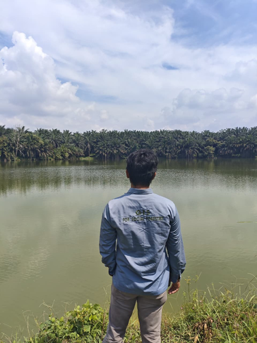

---
hide:
  - toc
  - navigation
---

  
  <h1>Reihan Apriandi</h1>
  
<strong>Forestry &amp; Spatial Data Science</strong>

  
<em>Remote Sensing · Environmental Analytics · Evidence-Based Conservation</em>

---

## About Me

I am a final-year Forestry undergraduate at Universitas Riau with field and professional
experience in land compliance supervision, above-ground biomass surveys, land cover analysis,
and carbon project support. I integrate forestry expertise with spatial data science — applying
GIS, remote sensing, and Python-based analytics to evidence-based conservation, sustainable
forest management, and climate-related research.

I am currently seeking entry-level opportunities in GIS analysis, remote sensing,
or environmental data roles where I can contribute to forest monitoring and
conservation work.

  

---

[View My Projects :material-arrow-right:](projects/index.md){ .md-button .md-button--primary }
[Download CV :material-download:](assets/reihan-CV.pdf){ .md-button }

---

## Skills & Certifications

-   :material-map:{ .lg .middle } **GIS & Remote Sensing**

    - QGIS, ArcGIS, GeoDa, GRASS GIS — Advanced QGIS certificate (Spatial Thoughts, 2026)
    - Google Earth Engine for land cover and change analysis
    - Satellite imagery workflows from NASA ARSET trainings — land cover change, active fire & smoke, water quality, hyperspectral data
    - Accuracy assessment with confusion matrices — validated land cover datasets to ~90% against field reference data at RECOFTC
    - Climate-focused GIS — Esri *GIS for Climate Action* (2026)

-   :material-tree:{ .lg .middle } **Forestry & Field Work**

    - AGB & carbon stock surveys — DBH, height, species ID (peatland study, PT Hatfield)
    - Allometric equations & ground-truth validation
    - Plot boundary staking & excavation compliance supervision
    - Forest governance & REDD+ — RECOFTC and UNITAR/UN Environment certificates

-   :material-chart-line:{ .lg .middle } **Data Analysis & Programming**

    - Python (Pandas, Matplotlib), R, SQL — exploratory analysis, visualization, supervised classification with scikit-learn
    - Google Data Analytics Professional Certificate (2025)
    - Oracle Cloud Infrastructure 2025 Certified Data Science Professional
    - DataCamp — Certified Data Analyst Associate · AI Engineer for Data Scientists Associate
    - Time Series Analysis — openHPI

-   :material-web:{ .lg .middle } **Applications & Tools**

    - Web maps & dashboards — Leaflet.js, Folium, Streamlit
    - Copernicus Marine Service workshops — marine & ocean data (2025)
    - UAV photogrammetry — Agisoft Metashape, OpenDroneMap
    - Tiger density population analysis — Harimau Kita (2024)

Every credential, with issuer and date, is listed on the [Experience page](experience.md#certifications).

---

## Connect

[GitHub :fontawesome-brands-github:](https://github.com/Hansen-arch){ .md-button }
[LinkedIn :fontawesome-brands-linkedin:](https://www.linkedin.com/in/reihan-apriandi-700845266/){ .md-button }
[Email :material-email:](mailto:apriandireihan@gmail.com){ .md-button }
