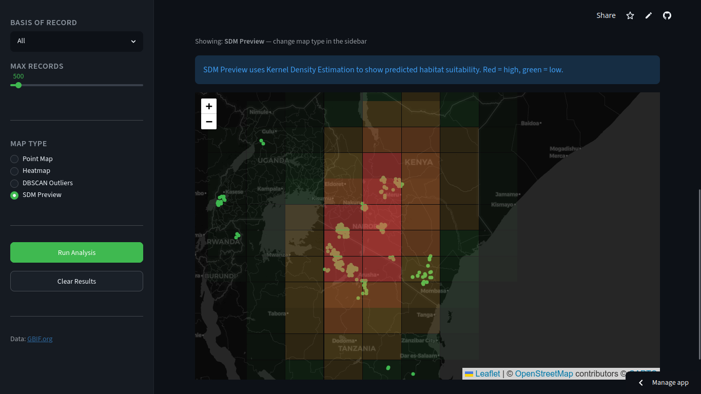
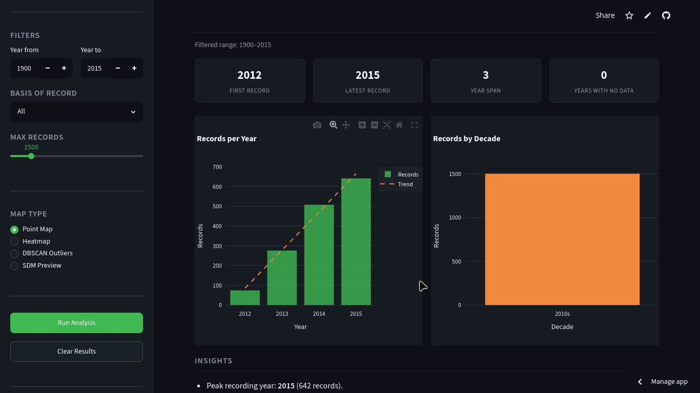
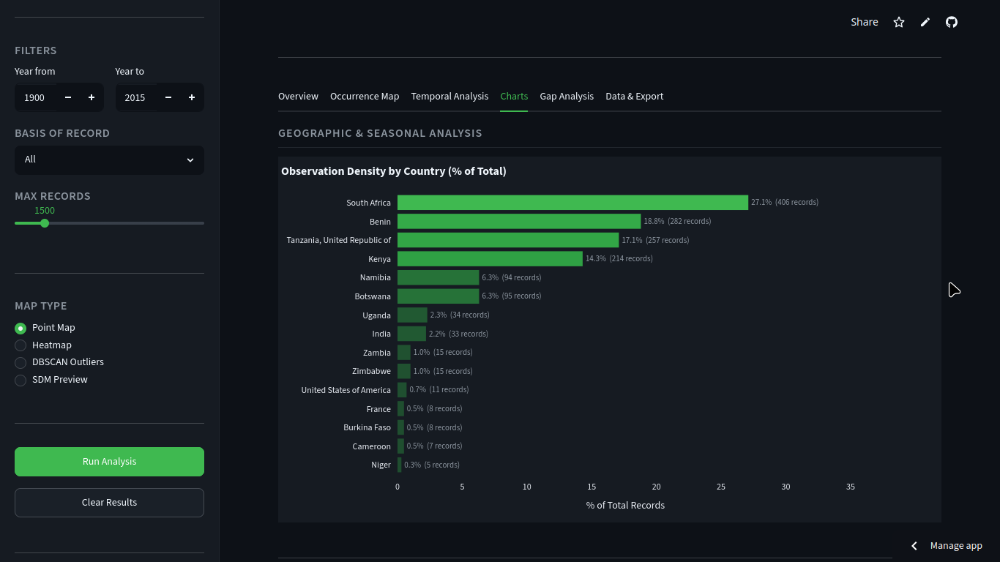
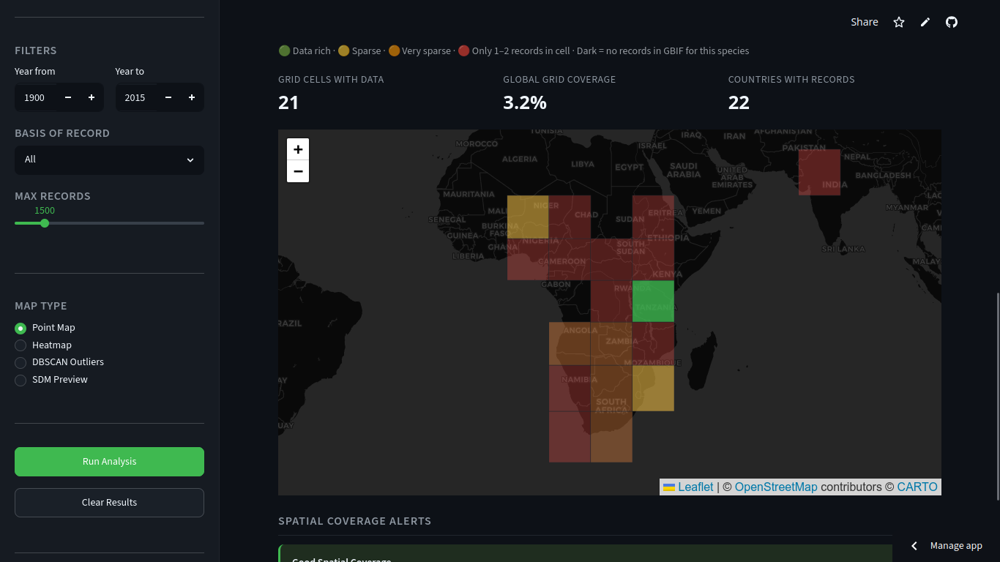

<!--
CHECKLIST FOR THIS PAGE (copy this file for each new project):
- [x] Replace [YOUR PROJECT TITLE] with your project title
- [x] Replace the hero image with your own (add to docs/assets/images/)
- [x] Update the Overview section
- [x] Update the Methods & Tools section
- [x] Update the Key Findings section
- [x] Update the Links section
- [x] Add a card for this project on docs/projects/index.md
- [x] Add a nav entry in mkdocs.yml
-->

# BioSift — Biodiversity Data Intelligence Platform

## Overview

BioSift is an open-source biodiversity data quality diagnostic tool that enables researchers, conservationists, and data managers to instantly assess the quality, completeness, and reliability of species occurrence data from the Global Biodiversity Information Facility (GBIF) — with zero setup required.

**Study Area:** Global  
**Duration:** 2026  
**Role:** Solo project  
**Status:** Completed — submitted to the 2026 GBIF Ebbe Nielsen Challenge

---

## Methods & Tools

**Data Sources**

- GBIF.org — Global Biodiversity Information Facility (occurrence records via public API)

**Processing Steps**

1. Fetch species occurrence data from the GBIF API with configurable year range, basis of record, and record limit filters
2. Run 10 automated quality checks including missing coordinates, zero coordinates, duplicate records, coordinate-country mismatch, low precision flagging, and temporal gap detection
3. Generate spatial diagnostics using interactive point maps, heatmaps, DBSCAN-based outlier detection, and Kernel Density Estimation (KDE) species distribution model preview
4. Score each record for reliability (0–100) and assess data fitness for 5 scientific use cases
5. Export results as CSV, reliability-scored CSV, and Darwin Core Archive (DwC-A) for standards-compliant reproducibility

**Tools Used**

| Tool | Purpose |
|------|---------|
| Python + Streamlit | Web application framework and UI |
| pygbif | GBIF API wrapper for occurrence data retrieval |
| pandas | Data cleaning, filtering, and manipulation |
| folium + plotly | Interactive maps and charts |
| scikit-learn | DBSCAN spatial outlier detection |
| scipy | Kernel Density Estimation for SDM preview |

---

## App Screenshots

### Occurrence Map
Interactive point map with clean records (green) and flagged records (red).

### Temporal Analysis
Records per year chart with trend line showing data collection patterns over time.

### Charts & Statistics
Country observation density, basis of record breakdown, and coordinate precision tiers.

### Gap Analysis
Global data gap map using 10° grid cells with spatial coverage alerts.

---

## Key Findings

- Implemented 10 automated quality checks that generate a data health score (0–100%) for any GBIF species dataset in seconds
- Supports batch comparison of up to 5 species side by side with downloadable comparison reports
- Generates publication-ready reproducible methods paragraphs and GBIF dataset citations in APA and BibTeX formats
- Exports Darwin Core Archive (DwC-A) ZIP files compliant with biodiversity data standards
- Deployed as a fully public web app with no installation required, accessible to researchers, educators, and policy makers globally

---

## Links

[🔗 Live Demo](https://biosift-gbif.streamlit.app){ .md-button }
[View Code on GitHub](https://github.com/Hansen-arch/biosift){ .md-button }
[GBIF Ebbe Nielsen Challenge](https://gbif.org/news/3DyM3tK5wgYipqyaHwG2c2){ .md-button }