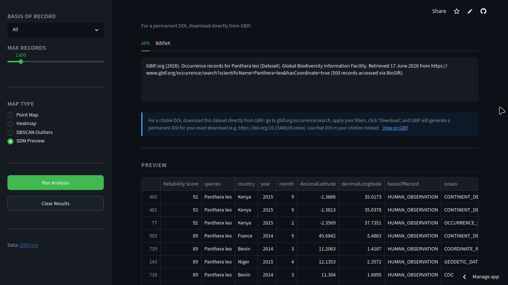
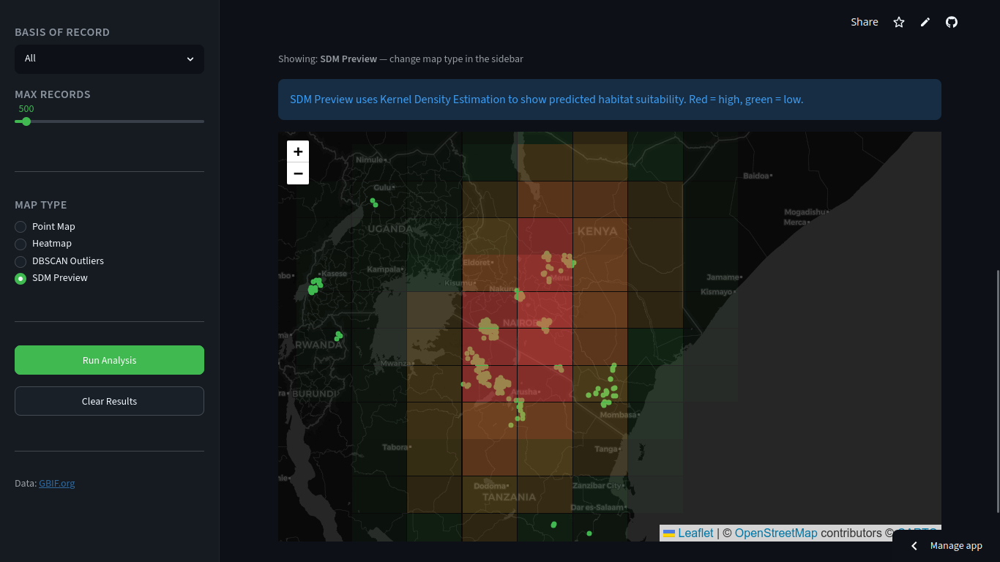
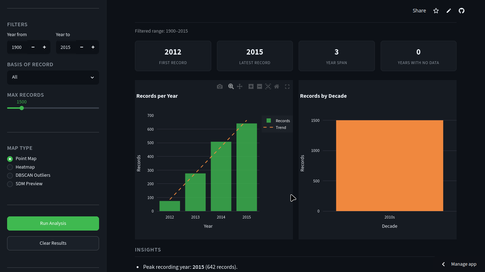
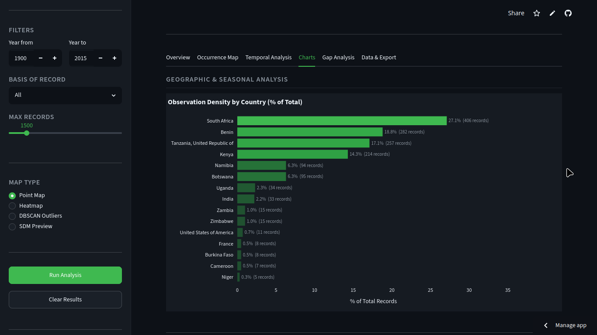
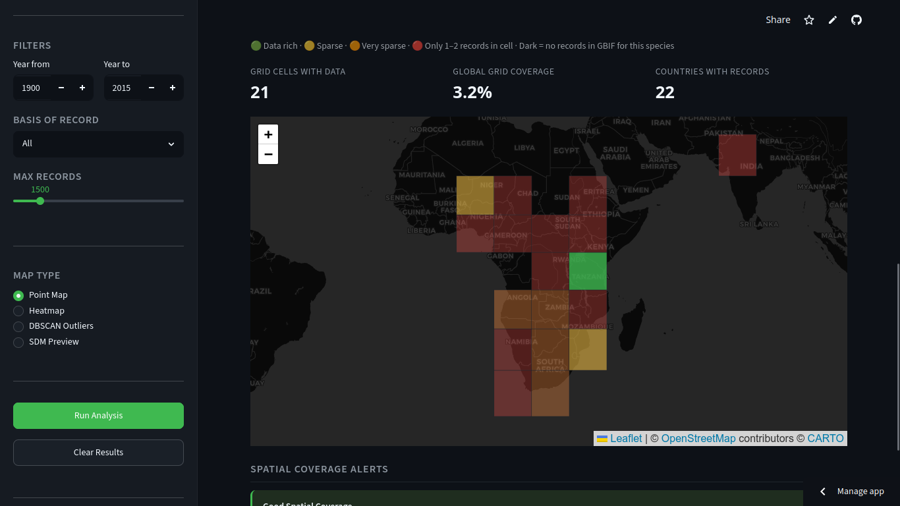

# BioSift

## Overview

BioSift is an open-source web app for checking the quality of species occurrence records from
the Global Biodiversity Information Facility (GBIF). GBIF aggregates data from thousands of
publishers, and before a dataset is used for analysis it helps to know how reliable it is:
whether coordinates are missing or misplaced, whether records are duplicated, and where
coverage gaps are. BioSift automates those checks. Enter one or more species names, set a
year range, and the app fetches the records from the GBIF API, scores them, and reports the
results.

**Study area:** Global
**Year:** 2026
**Role:** Solo project
**Status:** Completed; submitted to the 2026 GBIF Ebbe Nielsen Challenge

---

## Methods & Tools

**Data source**

- GBIF.org occurrence records, retrieved through the public API

**Processing steps**

1. Fetch occurrence data from the GBIF API with filters for year range, basis of record, and record limit
2. Run ten automated quality checks: missing coordinates, zero coordinates, duplicate records, coordinate-country mismatch, low coordinate precision, and temporal gap detection
3. Produce spatial diagnostics: an interactive point map, heatmaps, DBSCAN-based outlier detection, and a Kernel Density Estimation (KDE) preview of the species distribution
4. Score each record for reliability on a 0–100 scale and rate the dataset's fitness for five scientific use cases
5. Export results as CSV, reliability-scored CSV, or a Darwin Core Archive (DwC-A)

**Tools**

| Tool | Purpose |
|------|---------|
| Python + Streamlit | Web application |
| pygbif | GBIF API access |
| pandas | Data cleaning and filtering |
| folium + plotly | Interactive maps and charts |
| scikit-learn | DBSCAN spatial outlier detection |
| scipy | Kernel Density Estimation |

---

## App Screenshots

### Occurrence Map
Interactive point map with clean records (green) and flagged records (red).

### Temporal Analysis
Records per year with a trend line, showing how collection effort has changed over time.

### Charts & Statistics
Country observation density, basis of record breakdown, and coordinate precision tiers.

### Gap Analysis
Global data gap map on a 10° grid, with alerts for cells with little or no coverage.

---

## What the App Does

- Runs ten quality checks and summarizes each dataset with a data health score from 0 to 100%
- Compares up to five species side by side and exports the comparison as a report
- Generates a methods paragraph and GBIF dataset citations in APA or BibTeX format
- Exports cleaned records as CSV or Darwin Core Archive (DwC-A)
- Runs in the browser with no installation; the source code is public

---

## Links

[Live app](https://biosift-gbif.streamlit.app){ .md-button }
[Source code](https://github.com/Hansen-arch/biosift){ .md-button }
[GBIF Ebbe Nielsen Challenge](https://gbif.org/news/3DyM3tK5wgYipqyaHwG2c2){ .md-button }
