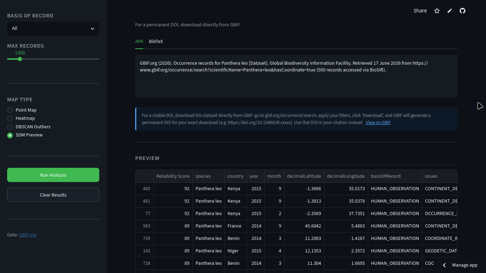

---
hide:
  - toc
  - navigation
---
<!--
CHECKLIST FOR THIS PAGE:
- [x] Replace the two placeholder cards (marked [YOUR PROJECT ...]) with your real projects
- [x] For each project: add a thumbnail image to docs/assets/images/ and update the path below
- [x] For each project: create a project page by copying sample-project.md
- [x] For each project: add a nav entry in mkdocs.yml (see the comments there)
- [x] Delete placeholder cards you don't need yet
-->

# Projects

A selection of my geospatial and data science projects. Click any card to see the full write-up.

**[BioSift — Biodiversity Data Intelligence](biosift.md)**

Open-source biodiversity data quality diagnostic tool powered by GBIF. Performs 10 automated quality checks, spatial outlier detection, and generates Darwin Core Archive exports — built for the 2026 GBIF Ebbe Nielsen Challenge.

`Python` `Streamlit` `GBIF` `scikit-learn` `folium`

[View Project →](biosift.md){ .md-button }

